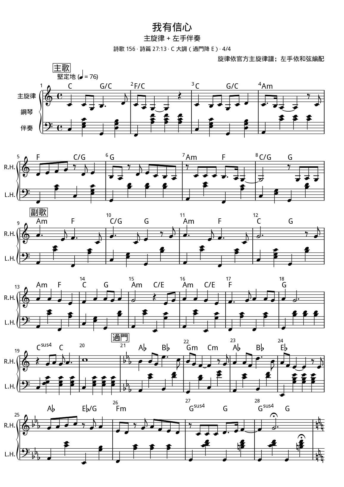
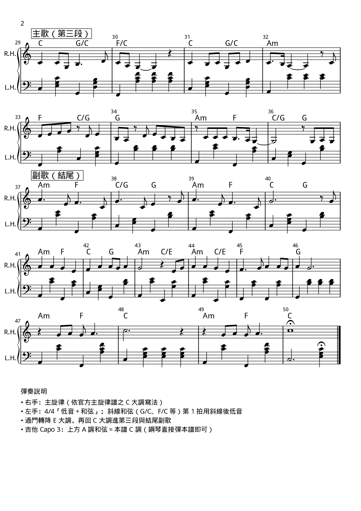
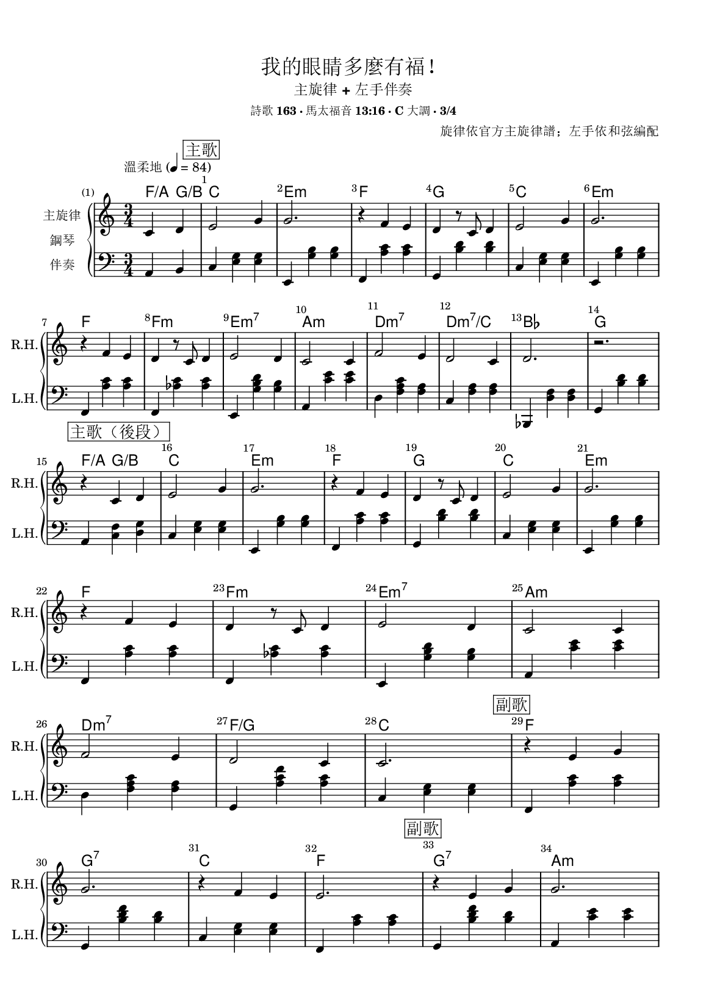
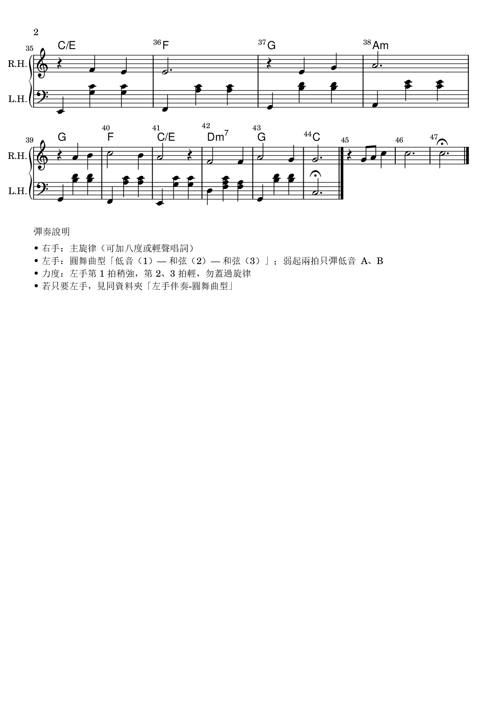

# JW-Music

耶和華見證人詩歌：**主旋律 + 左手伴奏**五線譜（PNG）。

旋律依官方主旋律譜；左手為個人練習編配，僅供個人練習分享。

工作區在私有庫 `JW-Work/音樂/`；本庫為公開鏡像。同步指令：`python 音樂/scripts/publish_music.py`。

協定：[Music-Sheet-Flow.md](Music-Sheet-Flow.md)

## 曲目

### [156-我有信心](156-我有信心/)

### [163-我的眼睛多麼有福](163-我的眼睛多麼有福/)

## 連結

- Repo: https://github.com/yushoudba/JW-Music
- 各曲 PNG 可用 raw 網址，例如：
  `https://raw.githubusercontent.com/yushoudba/JW-Music/main/163-我的眼睛多麼有福/主旋律加左手伴奏-v01-page1.png`
