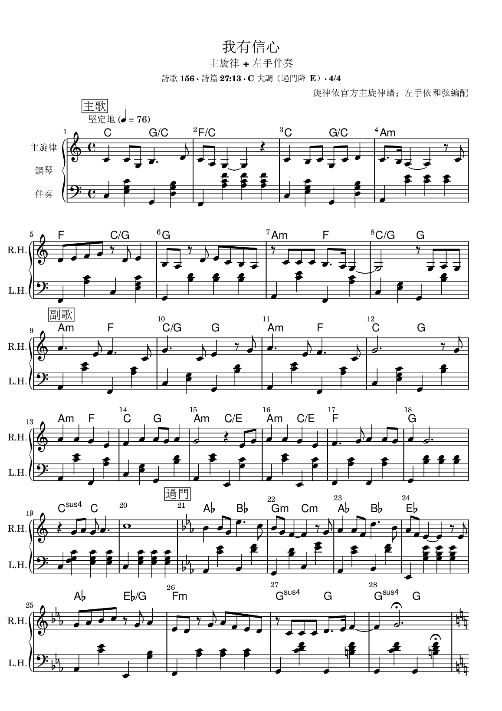
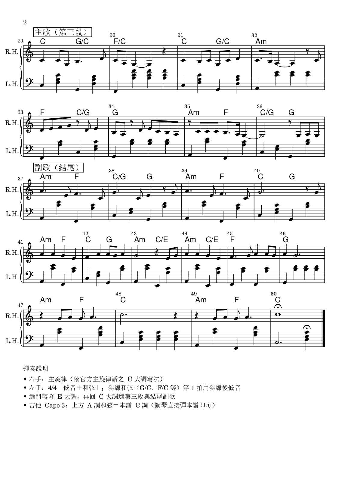
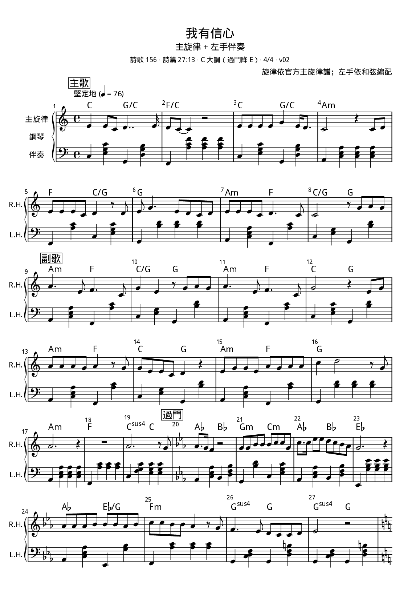
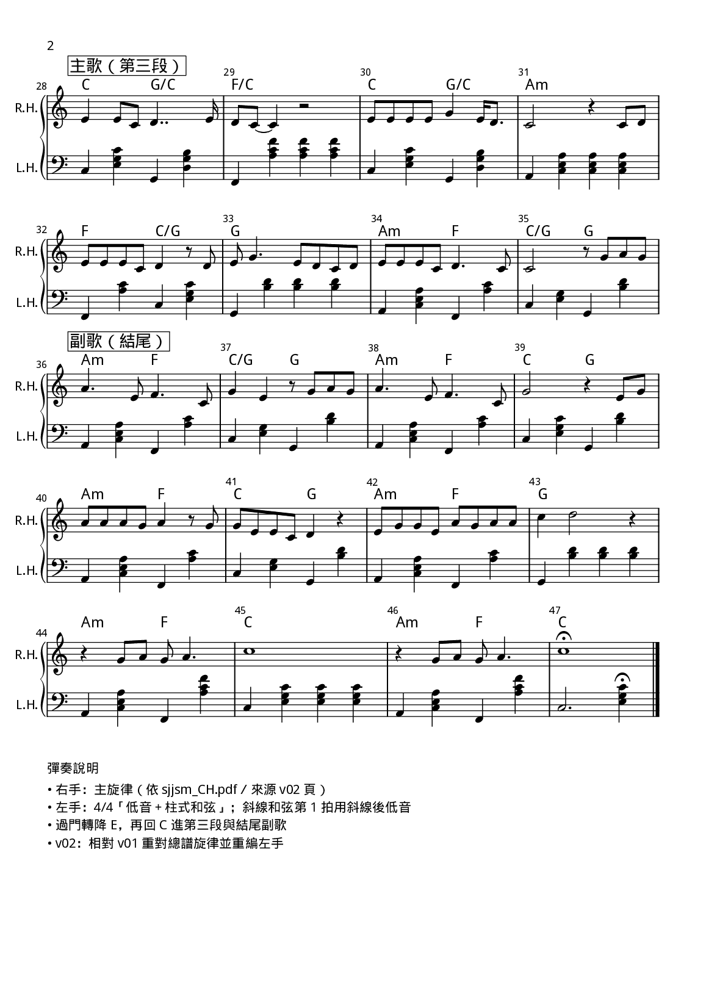

# JW-Music

耶和華見證人詩歌：**主旋律 + 左手伴奏**五線譜（PNG）。

旋律依官方主旋律譜；左手為個人練習編配，僅供個人練習分享。

工作區在私有庫 `JW-Work/音樂/`；本庫為公開鏡像。同步：`python 音樂/scripts/publish_music.py`。

曲目資料夾與圖檔**僅用詩歌編號**（例 `156/`、`156-v01-page1.png`）。

協定：[Music-Sheet-Flow.md](Music-Sheet-Flow.md)

## 曲目

### [156 我有信心](156/)

### [163 我的眼睛多麼有福](163/)

## 連結

- Repo: https://github.com/yushoudba/JW-Music
- 範例 raw：`https://raw.githubusercontent.com/yushoudba/JW-Music/main/156/156-v01-page1.png`
